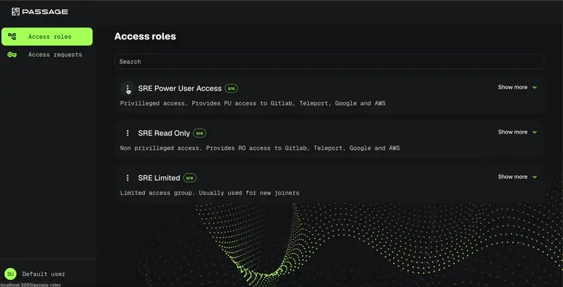

# Overview

## What is Passage?
Passage Server is a powerful, open-source access control management solution built in Go. It provides a centralized portal for managing and automating role-based access across multiple platforms and cloud services. Designed with flexibility and scalability in mind.



Head to [Passage documentation](https://cto2bpublic.github.io/passage/) to know more.

## Getting Started  

### Running Passage Locally  
To start the Passage server locally, run:  

```sh
go run main.go
```

This will launch Passage Server using the default configuration file inside the configs directory.

### Database Configuration
By default, Passage uses an SQLite database. However, it also supports other databases like PostgreSQL and MySQL. Check the [database configuration guide](https://cto2bpublic.github.io/passage/configuration/Database/) for more details.


### API documentation

Passage uses **gin-swagger** for API documentation.  

#### Generating Swagger Docs  

To generate Swagger documentation, install `swag` first:  

```sh
go install github.com/swaggo/swag/cmd/swag@latest
```

Then, initialize the Swagger documentation:
```sh
swag init
```